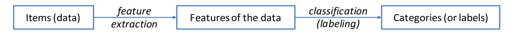

[[MSE]] [[AnTeDe]]
# Introduction
Banks want to do automatical summaries of investment reports.

It is important to take to correct metric for getting the right result. F1_Score is not always the best metric.

## How you should proceed with NLP-problems
1. Frame the problem and look at the big picture.
1. Get the data.
1. Explore the data to gain insights.
1. Transform the data to better expose patterns to ML algorithms.
1. Explore different ML models and shortlist the best ones.
1. Fine-tune your models and combine them into a solution.
1. Present the solution to colleagues.
1. Launch and monitor the system.

## Data preparation
1. Train a model with the data and evaluate it based on the validation / development set.
1. Get insights how your selected model will perform with the test-data (**ONLY AT THE END WHEN THE MODEL IS SELECTED**)

## POS-Tagging
Check for the different kind of Tags (There are 9 Categories). You can tag them by **rules**, with **neural networks** etc... Caution: Words are created all day (nouns, verbs, adjectives...).

## Tokenization / Sentence Segmentation
You can combine them to fix issues with *Mr. Jones* which could by a sentence split by easy rules.
