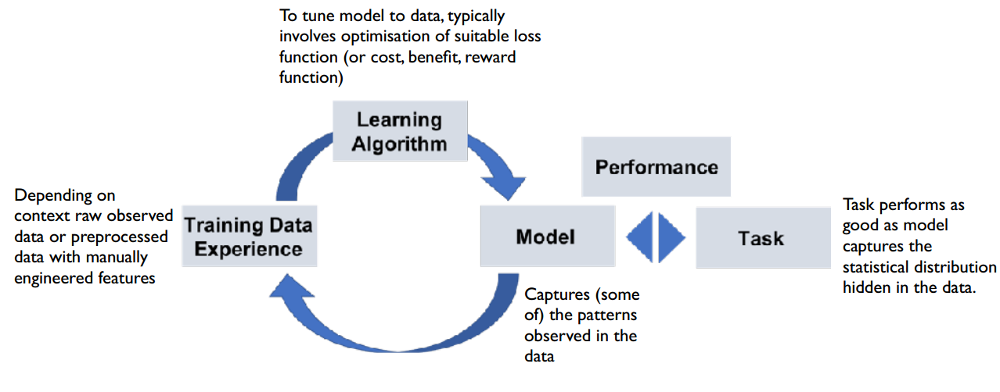
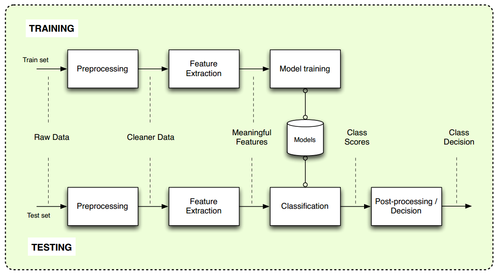

# Introduction

[[MSE]] [[DeLearn]]
## What is ML ?
1. Learning from data

## Why do we need ML?
1. We dont know the rules
2. where math stops
3. very complex problems

## ML apps?
1. Object detection
2. Generate new data
3. High dimensional data (images, sound)

## DL $\neq$ ML?
1. DL is learning from feature extraction
2. DL is a part of ML

## Dangers of DL?
1. Biased data
2. AI explainability
3. Don't rely to much on the models

# Definitions
> Machine learning consists computer methods that analyse observation data to automatically detect patterns, and then use the uncovered patterns to perform tasks based on new unobserved data.

> “[Machine Learning is the] fi eld of study that gives computers the ability to learn without being explicitly programmed.” - Arthur Samuel, 1959

> Machine Learning could be defi ned as a set of methods that automatically detect patterns in data, and then use the uncovered patterns to predict future data, or to perform other kinds of decision making under uncertainty. - Machine Learning – A Probabilistic Perspective, K. Murphy, 2012.

> A machine learning program is said to learn from experience E with respect to some task T and some performance measure P, if its performance on T, as measured by P, improves with experience E. - Machine Learning, T. Mitchell, 1997.

## Supervised Machine Learning 
> With supervised learning, the goal is to extract some relevant features x from raw observation data o and to learn a mapping from inputs x to outputs y given a set of example data called the training set. 

**PROBLEM 1**: We need large quantities of human validated examples! …and this is costly to build

**PROBLEM 2**: Because of the variabilities, we will need even more data and the mapping functions need to capture more complexities. 

**PROBLEM 3**: We usually spend a lot of time to hand-craft interesting compact features, this is called feature engineering

