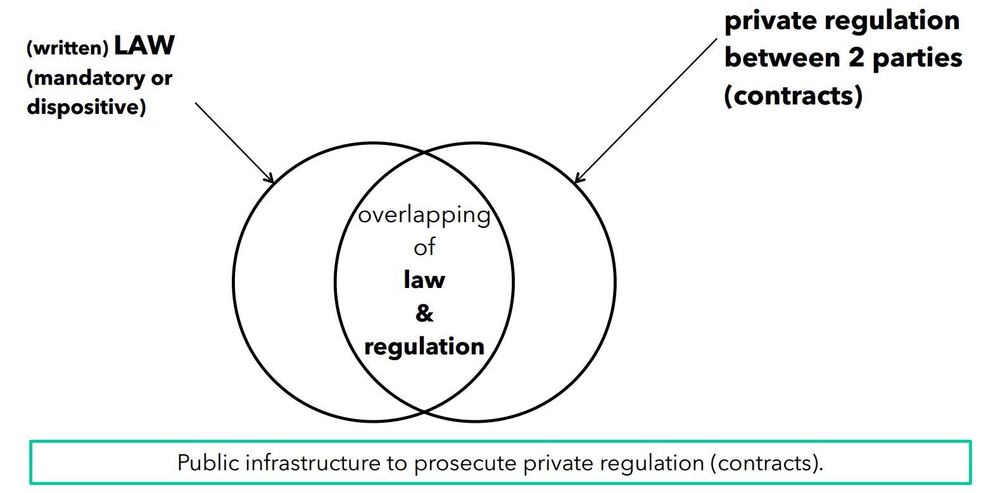
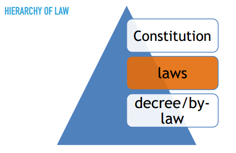

# Introduction [[PrivLaw]] [[MSE]]
s
## Why law?
Law are not only books - there are agreements for rules as well.

Law is social framework 
Rules save energy - compared to Parents and children
Without **Risk** - most businesses are not successful.
Lawyer should not only support one side - more find the best solution for both sides of a given problem.
In technical projects legal support is necessary as early as possible! Otherwise they might be **shot off** in the very last minute!
By law the management is personally responsible to organise & control the legal compliance! (Art. 754 OR)

# Privacy and data protection
Privacy and the right to forget is essential to develop personally (without social control)
It protects people
We spread data everywhere with the risk for loosing reputation.
Personal data has a financial worth.
Young generations are more sensitive to privacy than the boomers.

You have to check in an early stage which law fields are touched and where you can adapt (if it is not already strictly regulated and stirctly defined)

A statement must be justified by an article and proof it with evidence $X = f_{\text{(Art. XXX) + (evidence YYY)}}$
**It is not enought to say which article is important, say as well why and because of which evidence you state you argument**

# Spearation of powers
1. Legislative (people, parliament) $\to$ Club members
2. Executive (BR, RR, authorities) $\to$ Vorstand
3. Judiciary (courts) $\to$ Controllers (Kontrollstelle)

Clubs are organized the same way (see above)

**In reality the ececutive has large discretion** as long as nobody appeal against order (large possibility to adapt and decide)

# Switzerland
- The people and the cantons building the swiss confederation and not vice-versa
- Cantons are in their power of legislation $\text{\underline{superior}}$ to the swiss confederation - its not top down, its bottem up (cantons to Country)
- **public authority is only entitled to legislate and act in a territory if it is $\underline{\text{\textbf{explicitly constitutional legitimation}}}$**

Decree & Law means $\to$ Verordnung and Gesetzt

Civil law is for Contracts
public law is for StGB,FMG,BÜPF/VÜPF,ElDI-V u.a.m.

# private / public Law
Civil law is mastered by **principle of freedom** of coalition & freedom

You have to recognize if you touch civil law or public law (ignore crime law at the moment)

By-LAW (Verordnung) $\ne$ order (Verfügung)
**Burden of proof** $\to$ you have to proof it !!
**if it becomes complicated - start to produce paper (mails, pictures, ask for names etc.) IT MUST BE USED AS PROOVE**

The **IPRG (Gesezt über das internationale Privatrecht)** is the gateway between swiss & foreign law.

Civil law - the court will ask about an advance on court costs $\to$ if you ask for millions, the cost in advance will be higher.

However looses a civil case - you must pay:
- court cost
- other party costs (lawyer)
- and your own costs

if you win the process - you don't have the money yet. Opposite party can go into bankruptcy

