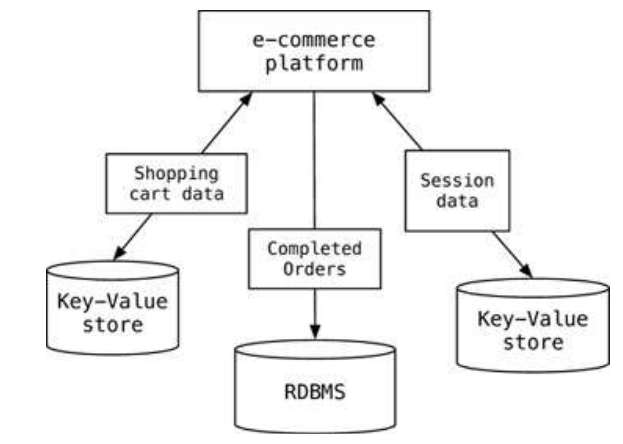

[[MSE]] Topic: [[DataMgmt]]

# Poliglot Persistence
You should use different Databases to takle different Problems. 

- Polyglot persistence is about using different data storage technologies to handle varying data storage needs.
- Polyglot persistence can apply across an enterprise or within a single application.
- Encapsulating data access into services reduces the impact of data storage choices on other parts of a system.
- Adding more data storage technologies increases complexity in programming and operations, so the advantages of a good data storage fit need to be weighed against this complexity.
