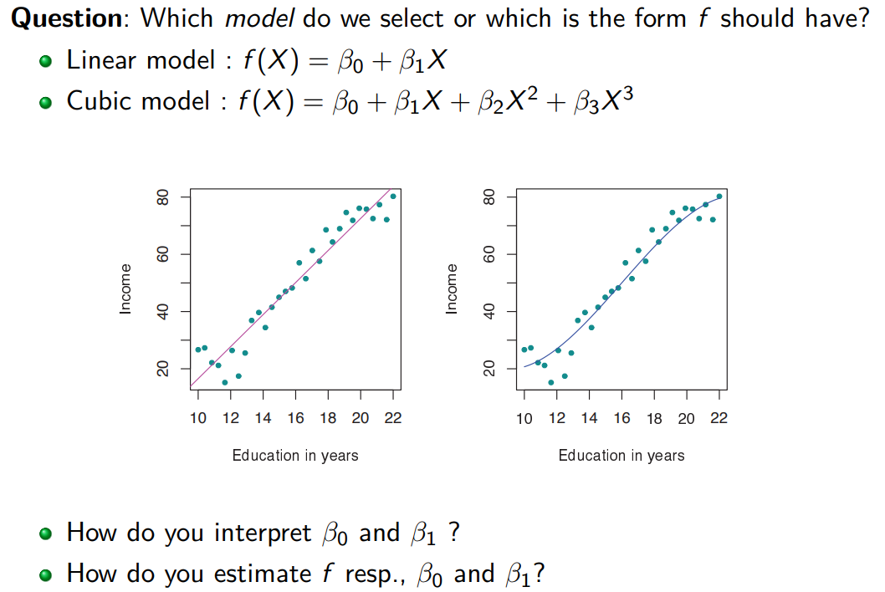

# LinearRegression
There is an Output variable $Y$ and one or multiple Input variable $X_1,X_2,X_3$ which then looks as the following: $Y = f(X_1, X_2, X_3) + \epsilon$

A cubic model is a linear model as well, as the $\beta$ terms are linear $\to$ $Y = \beta_1 + \beta_2 * X + \beta_3 * X^3$

$Y = \Beta_0 + \Beta_1 * X $ where $\beta_0$ is the intercept and $\beta_1$ is the slope.
**residual sum of squares RSS** is defined as $\text{RSS} = $
**residuals** are defined as $r_i = y_i - \hat{y}_i$

**standard error** $\to$ $se(\hat{\beta_0})^2 = \sigma^2 (\frac{1}{n} + \frac{\lineontop{x}^2}{\sum_{i=1}^n (x_i - \lineontop{x})^2})$

$\hat{\sigma} = \text{RSE} = \sqrt{\frac{RSS}{n-2}}$

# T-Test
How many times the standard deviation away from zero must $\hat{\beta_1}$ from 0?
It follows a T-Distribution with $n-2$ degrees of freedom.
