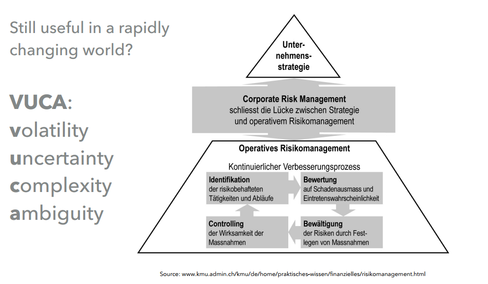
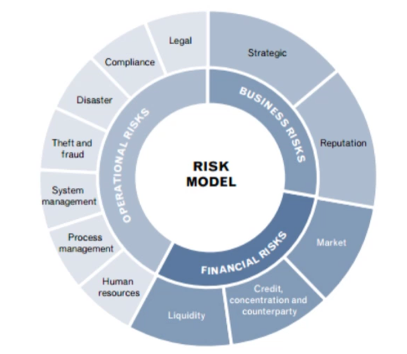
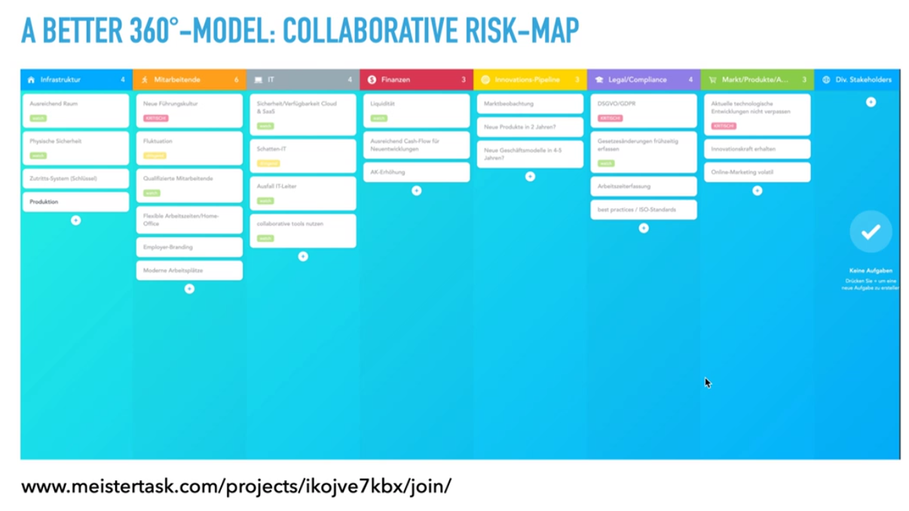
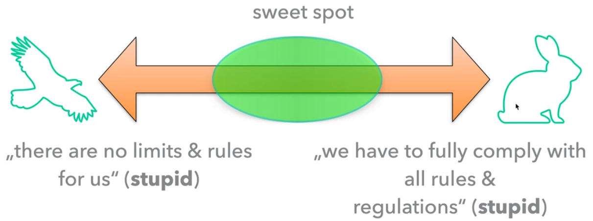

# Compliance and Records Management

## Compliance
### definition
Its not like coroprate governance

Swiss code $\to$ best practices for corporate governance (2002 established by economiesuisse)

It aims to encompass all the principles aimed at safeguarding sustainable company interest. Guarantees transparency and a healthy balance of management and control.

It has an important role wheter the ceo/board of directors acts professional or not

### 5 key functions

1. identy risks that an organisation faces (identification)
2. desing and implement controls to protect an organisation from those risks (prevent)
3. monitor and report the effectiveness of those controls in managment / exposure to risks (monitoring and detection)
4. resolve compliance difficulties as they occur (resolution)
5. advise the business on rules and controls (advisory)

#### Definition of risk
**Risk = proabiity of incident * potential of damage**

Danger not equal to risk
Risk management is important. 
You could prevent fatal financial loss - but normally you lose reputation as well.

### essentials of risk management
Identify risks 

Gute-Labor-Praxis --> SOP (Standard Operation Procedure)

VUCA

360° view of risk

Not only the main risks are problems. Take effort to find the small risks - especially when your leading a company - you can't see the problems of the "small men"

Dangerous is not knowing the risks!

Confirmation bias

cockpit syndrome - put pressure on the leading personal!

Control the little risks - they could lead to big problems!

don't decide on mood - make decision matrics!!

Risk managment map is important to quantify the risks and takle them afterwards

### life cycle of records
RECORDS MANAGEMENT (ISO 15489)

- Create
- Store
- Use
- Share
- Archive
- Destroy
- Create
- ...

Categorize all documents but be cautios with "non-essential"
- nonessential 
- useful
- important
- vital

**Different safekeeping periods - 5 to 10 years**

### essential laws for records management

- 957 ff OR
- GeBüV
- MWST (VAT)
- ZPO
- ATSG
- DSG
- and others

You need to keep the information **Art. 166 StGB**

Board of Directors as well **Art 754 OR - code of obligations**

Accounting vouchers with the annualand the audit report for 10 years!!! **Art. 958f OR** 

**Art. 2 GeBüV** - Geschäftsbücher Verordnung

INTEGRITY (AUTHENTICITY & UNALTERABILITY - **ART. 3 GeBüV**

The accounts must be kept and retained in such a way and 
the supporting documents must be recorded and retained in 
such a way that they cannot be altered without it being 
possible to establish that they have been altered.

- **ART. 4 GeBüV** Responsibility for infrastructure etc...
- **ART. 5 GeBüV** - general duties of care
- **ART. 6 GeBüV** availabitlty
- **ART. 7 GeBüV** separate the data
- **ART. 8 GeBüV** organize the data
- **ART. 9 GeBüV** media and migration (how we need to safe the data)
  - How the archived data is migration into future data formats!

**Art. 9 Abs. 1 VDSG (actual law) or ISO-Certification / GDPR**
- Protection against external physical influences (mostly natural hazards)
- Protection against unjustified access, control mechanisms ("four-eyes principle“)

- How get information about risk issues in a production company
  - Risk strategy should be available 
  - stay in touch with the production (weekly meetings etc...)

