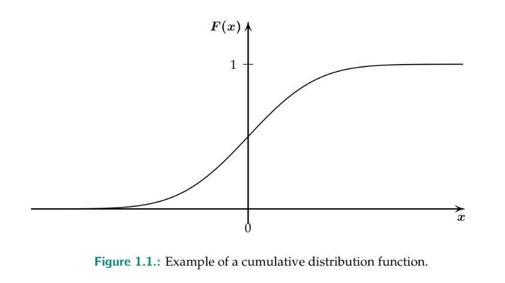
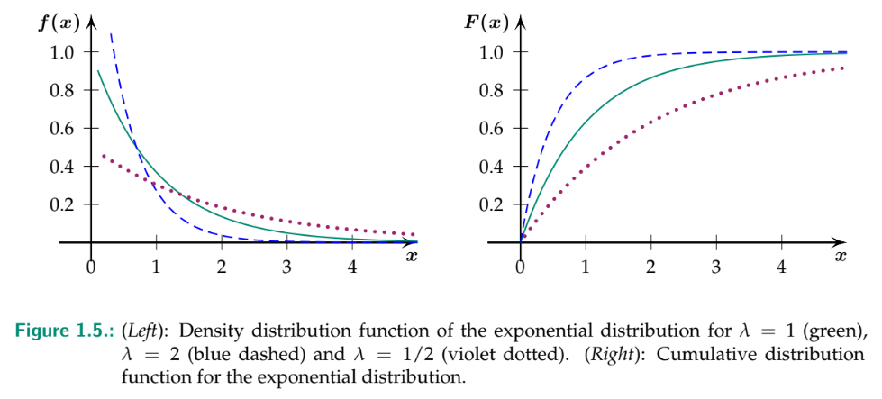

[[PredMod]] [[MSE]]
## Pre-Semster
### Cumulative Distribution Function
Cumulative Distribution Function is defined as follows: $F(x) = P(X \le x)$ where $X$ is the set of all possible values of the random variable and $x$ is the value of the random variable at which the CDF is to be evaluated. 
This is needed to get a range of values e.g. $F(X \in (a,b]) = P(a < X \le b)$ which is defined as $F(b) - F(a)$. Important as well. The derivative $F'(x)$ **is always 0 or bigger**

### probability density Function
The probability density Function is defined as $f(x) = F'(x)$ which is the derivative of the CDF.
The PDF must always be **zero or positive** - as the CDF is always monotonically increasing.
$P(a < X \le b) = F(b) - F(a) = \int_a^b f(x)dx$

### expected value
The expected value $E(X)$ and the standard deviation $\sigma_X$ have the same meaining in the discrete and the continuous case.
$E(X) = \int_{-\infty}^{\infty} x f(x) dx$ whereas $x$ is the outcome and $f(x) dx$ is the probability of the outcome.
### variance 
The variance $V(X)$ is defined as $V(X) = E(X^2) - E(X)^2$
### quantiles
The quantiles are defined as $q(a) = 182.5$ which means that 75% of the values are smaller than $q(a)$ and 25% are larger than $q(a)$.

# important continous distributions

## Uniform Distribution
The uniform distribution is defined as follows:
$$
f(x) = \left\{
    \begin{array}{ll}
        \frac{1}{b-a} & if a \le x \le b \\
        0 & else
    \end{array}
\right.
$$
`dunif(x = 5, min = 1, max = 10)` for the density of the uniform distribution at $x = 5$ from $1$ to $10$.
To get the probability of $P(1 \le X \le 5)$ use `punif(q = 5, min = 1, max = 10)`.
To generate random variables use the following code snippet: `runif(n = 5, min = 1, max = 10)`

## Exponential Distribution
The exponential distribution is defined as follows:
$exp(x) = e^x$
$$
f(x) = \left\{
    \begin{array}{ll}
        \lambda * exp(-\lambda x) & if x \geq 0 \\
        0 & otherwise
    \end{array}
\right.
$$
where we write $X \sim Exp(\lambda)$

Assuming $X \sim Exp(3)$ for $P(0 \le X \le 4)$ with R it is calculated as follows `pexp(4, rate = 3)`

### Poisson and Exponential Distribution
These two distributions are related. If the time elapsed between two failures of a system follows Exp($\lambda$), then the number of failures during the period t follows Poisson($\lambda * t$).
$P(T > t) = P(T \le t) = P(\text{no decay in} [0,t]) = \frac{(\lambda t)^0 e^{-\lambda t}}{0!} = e^{-\lambda t}$

## Normal distribution
This is the most important distribution: 
$f(x) = \frac{1}{\sigma \sqrt{2 \pi}} exp(-\frac{(x - y)^2}{2 \sigma^2 })$
the cumulative distirbution function cannot be explicitly expressed by formulas and must be calculated with software.
IQ Example:
$X \sim \mathcal{N}(100, 15^2)$ where 15 is the standard deviation.
Use R to get the value `1 - pnorm(130, mean = 100, sd = 15) = 0.022` - therefore 2% is highly gifted.

[[CDF]] [[PDF]] [[Expected Value]] [[Variance]] [[Quantiles]]
